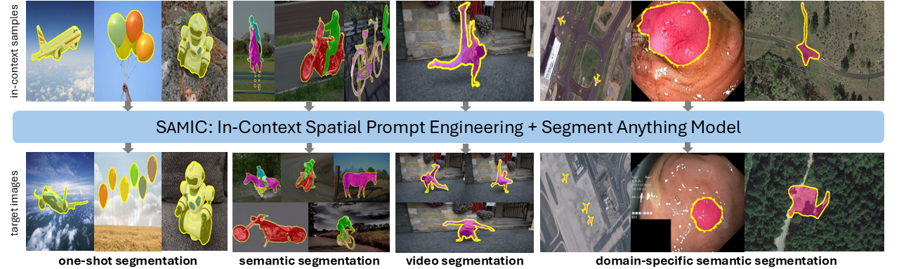

<h1>SAMIC: Segment Anything with In-Context Spatial Prompt Engineering  </h1>

[Savinay Nagendra](https://scholar.google.co.in/citations?user=rCV9Wn4AAAAJ&hl=en)1, &nbsp; 
[Kashif Rashid](https://scholar.google.com/citations?user=9VKN70wAAAAJ&hl=en)2, &nbsp; 
[Chaopeng Shen](https://scholar.google.com/citations?user=wGOOJi8AAAAJ&hl=en)1, &nbsp;
[Daniel Kifer](https://scholar.google.com/citations?user=QdTErIEAAAAJ&hl=en)1, &nbsp;

1[Pennsylvania State University, University Park, Pennsylvania](https://www.eecs.psu.edu/), &nbsp;
2[Schlumberger Research, Cambridge, Massachusetts](https://www.slb.com/about/who-we-are/our-technology-development)

CVPR 2025

## 🚀 Overview

The Segment Anything Model (SAM) is a promptable
vision foundation model (VFM) powered by large-scale
pre-training, designed to predict valid masks from spatial
prompts (e.g., pixel coordinates). With well-engineered
prompts, SAM transfers zero-shot to diverse downstream
tasks, often outperforming fully-supervised models. We
propose **SAMIC**, an in-context automated prompt engi-
neering method that generates task-specific spatial prompts
by learning fine-grained correspondences between a tar-
get image and a few labeled ”in-context” samples. Re-
cent training-free one-shot methods for in-context seg-
mentation use frozen VFM encoders to extract embed-
dings. They then compute cosine similarity-based corre-
spondence matrices to extract coarse location priors as
spatial prompts. Through extensive empirical experiments,
we observe that such methods (i) struggle with visual dis-
tractions, (ii) generalize poorly (only segmenting objects
similar to in-context samples), (iii) cannot handle multi-
ple object instances, and (iv) perform poorly on domain-
specific tasks like medical or remote sensing segmenta-
tion. These limitations arise because they overlook the
need for specific spatial prompts tailored to each segmen-
tation task such as define object boundaries, distinguish in-
stances, or group semantic regions. We show that instead
of using generic VFM embeddings for computing feature
similarity, SAMIC overcomes these challenges by ”learn-
ing” dense visual correspondences between in-context sam-
ples and targets. Through comprehensive experiments,
we demonstrate that SAMIC achieves state-of-the-art re-
sults on various segmentation tasks, with one-shot perfor-
mance of 88% on FSS-1000, 53.1% on COCO-20i, and
96% mIoU on PerSeg datasets. Additionally, we show that
SAMIC generalizes to custom datasets with minimal in-
context samples, low computational cost, and without the
need for pixel-wise labeling. 
